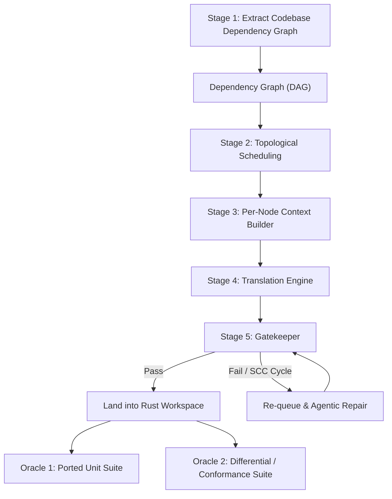

# Loretta-RS Port: Operational Plan (PLAN.md)

This plan details the translation methodology to port Loretta (`../references/Loretta/src/Compilers/Lua/Portable/`) verbatim from C# to Rust using `full-moon` (`../references/full-moon/`).

Keep this file in sync with `AGENTS.md`.

## Rationale

We are using `full-moon` because it is maintained on crates.io and stays automatically up-to-date with Luau syntax updates. This replaces the need to port Loretta's equivalent functionality, allowing us to port Loretta's remaining logic directly onto `full-moon`.

## Requirements

1. **Logic Parity.** Port Loretta's logic verbatim without omitting code.
2. **`full-moon` Integration.** Use `full-moon` instead of Loretta's lexer, parser, and syntax-tree model.
3. **Verbatim Translation.** Translate each graph node verbatim, staying diffable against C#.

---

## 1. The Atomization Principle (1 Symbol = 1 File)

Rather than translating entire monolithic classes in a single prompt, parse the codebase into **individual atomic symbols**. Each becomes one Rust file with explicit `use` imports.

Covering the full set of verified C# constructs in Loretta:

1. **Type declarations:** `class` (including `partial`, `static`, `abstract`, `sealed`), `struct` (including `readonly`), `interface`, `enum`, `record`, `delegate`.
2. **Callable members:** Methods (instance, `static`, extension, generic), iterator methods (`yield return` → `impl Iterator` or `Vec`), local functions, constructors (`.ctor`/`.cctor`), operator overloads (`==`, `!=`), conversion operators (`implicit`/`explicit`).
3. **State & Accessor members:** Properties (getters, setters, `init`), fields (`const`, `readonly`, `static`, instance), event fields.
4. **Language Constructs & Constraints:** Generic constraints (`where T : ...`), type aliases (`using X = Y;`), partial methods, attributes.
5. **Async Flattening:** `async Task` methods and tests flattened to synchronous Rust.

Prompts stay small (~20–50 lines). Every symbol can be independently scheduled, compiled, tested, and re-queued.

---

## 2. The 5-Stage Translation Pipeline

### Stage 1: Codebase Dependency Graph Extraction

- The C# codebase is parsed into a typed semantic graph — one node per class, interface, enum, record, delegate, method, property, field, etc. — with `declares`, `calls`, `type-uses`, `inherits`, `implements`, `overrides`, `contains-nested` edges. The graph, not the file tree, is the unit of work.
- Roslyn tool parses `../references/Loretta/src/` and extracts every declaration and member from §1. Nested types become discrete nodes.
- Excludes dropped subsystems (`Compilers/Core/`, `Parser/`, `Syntax/`, GLua). See `AGENTS.md` Port Boundary.

### Stage 2: Topological Scheduling (Bottom-Up)

- Computes the DAG and sorts bottom-up: leaf types → utilities → visitors → managers.
- Withholds **Strongly Connected Components (SCCs)** for hand-designed clusters.

### Stage 3: Per-Node Context Builder

For each scheduled symbol, assemble:

1. C# source for that single symbol.
2. Already-ported Rust signatures of its direct dependencies.
3. Every `full-moon` API it will call (verified with `grep` + `read`, including `#[cfg(feature=...)]` gates).
4. Strict constraints: no `todo!()`, no dropped arms, exact wrapping/shift/byte-offset semantics.

### Stage 4: Translation Engine

- Translates bottom-up against real Rust deps.
- Cycles: stub shape is committed first, bodies filled bottom-up.
- Failures: reverted and re-queued with a richer context card.

### Stage 5: Mechanical CI Gates & Dual Oracles

#### Gates (every landing)

1. `cargo check --workspace --all-features` clean.
2. `cargo clippy --workspace --all-features` — no new warnings. `#[allow]` forbidden.
3. **Drift check:** every public member exists or is documented as intentionally dropped; no `todo!()`, `unimplemented!()`, or `mod` deletions. Drift is checked immediately after every change, not at the end.

Failures after 3 genuine attempts: revert, re-queue at end of topo order with richer context, and take the next item. Never land red. No `blocked` status — every node stays `pending`/`claimed`/`done` until it lands. If the spec is wrong, open a `spec:` PR with evidence (see `COMMIT.md`).

#### Oracles (also on every landing)

1. **Oracle 1 — Ported Unit Suite.** `cargo test --workspace --all-features` green. 637 TUnit tests translated to `#[test]` case tables. Covers each ported subsystem (see §3).
   - `GreenNodeTests`/`RedNodeTests` test dropped infrastructure and are not ported.

2. **Oracle 2 — Differential / Conformance Suite.** `loretta-rs/tools/differential` (C# reference) vs Rust, compared byte-for-byte on `corpus/`:
   - diagnostics, normalized AST dump, scope tree, constant-folded output, minified output, symbol-display samples.
   - CLI commands are covered by `loretta-cli` integration tests.
   - Where the harness covers the item, byte-identical output on the corpus. A mismatch is a bug in Rust.

- **Rule:** Compiling is not correct. Oracles decide correctness.

---

## 3. Dropped Components & `full-moon` Replacements

`full-moon` is the lexer, parser, and AST. Never reimplement it.

**Dropped from Loretta:**

- `Compilers/Core/Portable/` (red/green trees, `SourceText`, diagnostics, pooling, `TreeDumper`)
- `Compilers/Lua/Portable/Parser/` (lexer, `LanguageParser`, `SlidingTextWindow`)
- `Compilers/Lua/Portable/Syntax/` (nodes, visitors, `Syntax.xml`, `Generated/`)
- `Tools/Generators/`, `Tools/Analyzers/`, `Tools/NightlyTool/`, `InternalBenchmarks/` harness

**Substitutions:** Use `full-moon` byte offsets and `&str`/`&[u8]` slices for `TextSpan`/`SourceText`. Walkers in `Script` and `Experimental` become `full_moon::visitors::Visitor`.

### Dialect Support

- **Supported:** `full-moon` feature set: `Lua 5.1`, `Lua 5.2`, `Lua 5.3`, `Lua 5.4`, `LuaJIT`, `Luau`, `CfxLua`.
- **Dropped:** GLua operators (`&&`, `||`, `!=`, `!`) and C-style comments (`//`, `/* */`). Documented as dropped per `AGENTS.md` Locked Decision 2.

### Subsystem Disposition

| C# source | Disposition | Rust destination | Oracle |
|---|---|---|---|
| `Compilers/Lua/Portable/Errors/` | PORT | `loretta/src/errors/` | 1 + 2 (diagnostics) |
| `Compilers/Lua/Portable/Scoping/` | PORT | `loretta/src/scoping/` | 1 + 2 (scope tree) |
| `Compilers/Lua/Portable/Script/` | PORT | `loretta/src/script/` | 1 + 2 (scope tree) |
| `Compilers/Lua/Portable/Utilities/` | PORT | `loretta/src/utilities/` | 1 + 2 (samples) |
| `Compilers/Lua/Portable/LuaSyntaxOptions` + `LuaParseOptions` + enums + `Operations/` | ADAPT | `loretta/src/options.rs` | 1 + 2 (per `LuaVersion`) |
| `Compilers/Lua/Portable/SymbolDisplay/` | PORT | `loretta/src/symbol_display/` | 1 + 2 (samples) |
| `Compilers/Lua/Experimental/` | PORT | `loretta/src/experimental/` | 1 + 2 (fold/minify) |
| `Compilers/Lua/CommandLine/` | PORT | `loretta-cli/src/main.rs` | 2 (CLI tests) |
| `Compilers/Lua/Test/Portable/` + `Test.Utilities` | PORT | `loretta-rs/tests/` | 1 |
| `InternalBenchmarks/samples/benchies/*.lua` | REUSE | `loretta-rs/corpus/` | 2 (seed) |

- Counts: `Lua/Portable` 99 hand + 6 generated (108 with `obj/`), `Experimental` 14, `Core/Portable` 217, `Test/Portable` 31 (30 hand + 1 generated, 637 `[Test]`s excluding generated).
- `LuaExtensions.cs` in `Portable/` is syntax helpers over dropped nodes — DROP. `Experimental/LuaExtensions.cs` is PORT.
